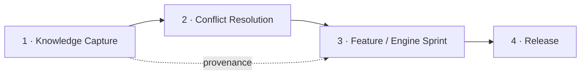

# Principles — the model this blueprint encodes

> The stack- and tool-agnostic core of the operating model, distilled from a real,
> long-lived project (a doctrine-heavy, correctness-critical app shipped over 37+
> sprints). Everything else in this repo — the tiers, the docs, the templates — is an
> *elaboration* of what's on this page. **Fidelity to these principles is the goal;
> fidelity to any particular file layout is not.**

---

## The two roles (tool-agnostic)

This model assumes a **human lead** plus AI assistance split into two capabilities.
Name them however your toolchain allows; the boundary is what matters:

| Role | Does | Never does |
| :--- | :--- | :--- |
| **Human (Product Owner / Lead)** | Vision, priorities, doctrinal/architectural decisions, and the **sole merge & release authority** | — |
| **Planning-and-Review agent** | Plans, writes specs, authors docs, opens PRs, reviews the real diff | Merge to `main`/`prod`; create tags |
| **Coding-and-Verify agent** | Implements specs, runs tests/QA locally, records results | Merge; adjudicate doctrine; edit unrelated files |

> In the source project these were "Kiro Web" (planning/review) and "Antigravity"
> (coding/verify). Substitute your own tools — the principles don't care which.

---

## The 5 load-bearing principles

### 1. The human is the sole merge & release authority
Agents push branches, open PRs, and validate CI — but **never merge to `main`/`prod`
and never create tags**. This single rule is what makes speed safe: agents can move
fast because the final gate is a human who cannot be bypassed.

### 2. One source of truth per fact — docs delegate, they don't duplicate
Every fact has exactly one owner: `git log` owns commit history, the tracker owns
the feature list, the valuation owns hours, the changelog owns release notes. Docs
**point** at each other instead of **copying**. Duplication is where rot begins — a
copied fact goes stale the moment its source changes.

### 3. Transactional artifacts + a freshness stamp
Verification work produces a **versioned, human-ticked record** (smoke test, release
notes, docs audit), stored beside the release it belongs to. Every durable doc carries
a `> Reviewed: vX.Y.Z` stamp near the top; a stamp older than the current release is a
**visible red flag**. This turns "did anyone check this?" from a hope into a check.

### 4. Spec → implement → review handoff
For any change that isn't trivial: the planning agent writes a **spec** (exact scope,
edge cases, test updates, and a *pre-flight known-green baseline*), the coding agent
proves it **green locally before the PR**, and the planning agent **reviews the real
diff** — not the coding agent's summary. Any value derived from an external/authoritative
source is flagged in the spec for explicit cross-verification before merge.

### 5. Provenance / traceability
Every non-obvious rule, feature, or decision **cites its source** (a spec item, a
resolved conflict, an authoritative reference). This makes quality claims *auditable*
rather than a slogan, and lets downstream docs (user guide, marketing, a book) inherit
the provenance instead of re-deriving it.

> **Supporting practice — the learnings/memory layer.** Capture decisions, gotchas,
> and deferrals *at the moment they happen*, outside chat history, so the process
> compounds instead of repeating mistakes. It's what makes the model *mature*.

---

## The 4-flow spine

Everything a project does maps to **four repeatable end-to-end flows**. All four are
run by the human orchestrating the two agent roles, and all four end at the same gate
(principle 1).

| # | Flow | Trigger | Coding/Verify agent | Planning/Review agent | Human | Artifact |
| :- | :--- | :--- | :--- | :--- | :--- | :--- |
| **1** | **Knowledge Capture** | New source material to digitize | Captures/transcribes → a corpus doc, strictly scoped | Designs prompt; verifies scope; opens PR | Merges | Corpus doc + transcripts |
| **2** | **Conflict Resolution** | An ambiguity / cross-source conflict in the corpus | (optional) verifies a proposal against sources | Presents the proposal (highest-impact first); scribes the decision | **Adjudicates** + merges | Resolved entry in the corpus |
| **3** | **Feature / Engine Sprint** | A backlog item scheduled into a sprint | Implements the spec; local green; fills summaries | Authors the spec; reviews the diff; closes out | Merges (+ later tags) | **Sprint dossier** (spec + impl + test summary) |
| **4** | **Release** | Sprint(s) ready to promote | QA-Verify smoke test on the deployed build | Runs release protocol; drafts notes + docs-audit | Merges + **tags**; ticks the docs-audit | **Release dossier** (smoke-test + release-notes + docs-audit) |

**How the flows connect:** Flow 1 feeds Flow 2 (can't resolve a conflict before the
sources exist); Flows 1+2 produce a conflict-resolved corpus that Flow 3 derives
features from *with provenance*; Flow 3 accumulates sprints that Flow 4 ships.

> **This is also the tier boundary.** Flows **3 & 4 are universal** — every project
> builds features and ships them. Flows **1 & 2 are doctrine-specific** — they only
> exist for projects built on a body of source knowledge that must be captured and
> reconciled. That distinction is exactly what separates the two tiers (see
> [`tiers/`](tiers/README.md)).

---

## Applying this — the two tiers

- **[Core](tiers/core/README.md)** — long-lived products. All 4 flows, dossiers,
  freshness stamps, the docs-audit gate, and the full doc set.
- **[Min](tiers/min/README.md)** — quick / mini / PoC. Flows 3 & 4 only, collapsed:
  one `README` (with a status block) + one `PROJECT.md`, and the PR description *is*
  the transactional record.

**Graduation rule:** a Min project adopts a heavier Core practice the **first time it
gets burned without it** — never preemptively. Start light; earn the weight.
